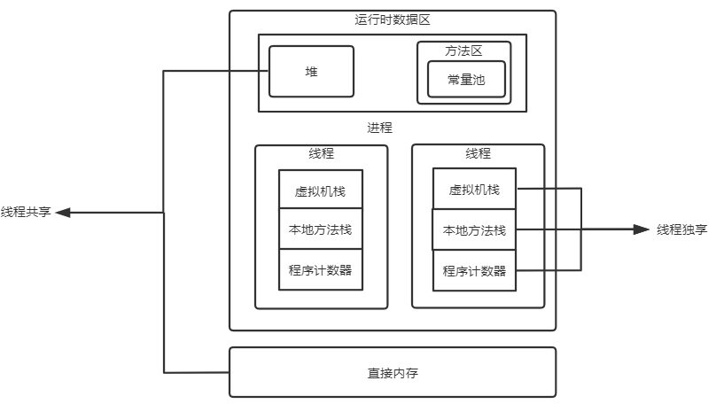
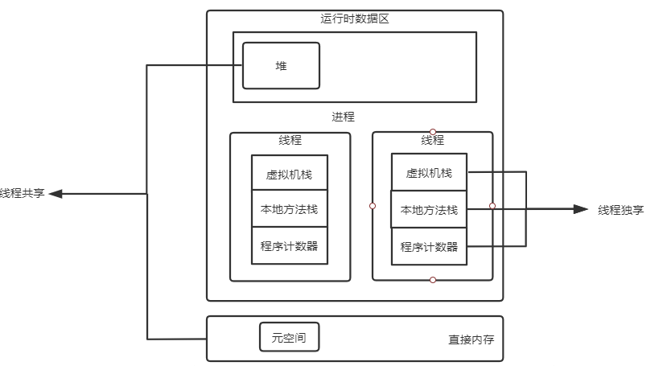

# JVM
编译型语言：
源码-> 编译-> 目标代码-> 执行  
解释型语言 （可以跨平台，匹配到相对的解释器）：
源码-> 解释器-> 执行  

java(解释型语言):
源码-> 编译-> 字节码文件 -（加载到JVM）->解释-> 执行  

 JVM的内存模型

### 类加载子系统：  
加载步骤   
1.装载 类名+包名+实例ID，不同的类加载器加载相同类是不一样的  
 2.链接 校验，确保合法  
 3.初始化 四种初始化类型： new  反射 子类调用初始化 JVM启动过程中指定的初始化类  
### 执行引擎：（待完善）

### 运行时数据区

JVM在运行java进程时会将管理的内存分为诺干个区域，我们根据线程之间的是否共享来对内存进行划分    
在jdk1.6时：  
    
  线程共享的区域：堆，方法区（包括常量池），直接内存（这部分不属于运行时数据区）。  
  线程独占的区域：虚拟机栈，本地方法栈，程序计数器

在jdk1.8时：在运行时数据区移出了方法区，在直接内存里面添加了元空间
  
  线程共享：堆，直接内存（包括元空间）  
  线程独占：虚拟机栈，本地方法栈，程序计数器

java内存可以粗糙的分为堆空间和栈空间，其中栈空间就是虚拟机栈，或者说栈空间是虚拟机栈的局部变量表部分
#### 栈
虚拟机栈是由一个个栈帧组成的，每个栈帧都拥有：局部变量表、操作数栈、动态链接、方法出口信息。  
局部变量表主要存放了编译器可知的各种数据类型（八种基本类型）以及对象引用（reference类型，根据对象寻址方式不同，对象引用可以是对象内存地址，也可以是指向对象地址的句柄）
#### 堆
分为年轻代和年老代 

对象首次创建放在年轻代的Eden区，当对象达到一定年龄（经过N次GC）将对象放到年老代。

### 对象在内存中的存储布局
普通对象  T t = new T();  
1.markword   
2.类型指针   class pointer：指向对象的类   
3.实例数据 instance data   
4.对齐 padding

### 对象头包括什么 markword包括什么
对象头包括 markword和类型指针
三方面信息：  可以通过jol Java object layout查看
1.锁信息  
2.hashCode()  
3.GC信息 分代  

### 对象怎么分配

 1. 首先在可以往栈上分配先往栈上分配 ：对象小且简单 对标C的struct
 2. 如果对象体量较大，分配到堆上的老年代l
 3. 否则通过TLAB （threa local alocation buffer）分配到年轻代的Eden区
 4. 如果对象大小大于TLAB的大小或者TLAB剩余空间不足以分配，则使用CAS的方式来分配对象
 
 内存分配并发问题：创建对象时一个很重要的问题就是线程安全问题。因为在实际开发过程中，
 创建对象是个很频繁的过程，JVM必须保证该过程是线程安全的。通常JVM通过以下两种方式来确保对象创建时的线程安全      
 CAS+失败重试：CAS是乐观锁的一种实现方式，如果因为冲突失败就重试操作，直到成功为止。**JVM采用CAS配上失败重试来保证更新操作的原子性**  
 TLAB:为每个线程在Eden区预分配一块内存，JVM在为线程中的对象分配内存时，先在TLAB上分配，当对象大于TLAB剩余空间大小或者TLAB空间不够时，在进行CAS+失败重试操作。
 
### 对象创建过程

1. [类加载](#类加载子系统：)检查：jvm在遇到new指令时，先检查指令参数能否在常量池中定位到这个类的符号引用，并检查这个给符号引用代表的类是否已被加载、
解析和初始化过。如果没有必须先执行相应的[类加载过程](https://blog.csdn.net/zhangliangzi/article/details/51319033)。
2. 分配内存：在类加载检查完成后，为新生对象分配内存，对象所需的内存大小在类加载完成之后便可以确定，为对象分配空间的任务等于把一块
确定大小的内存从堆空间划分出来。内存分配有两种方式：指针碰撞和空闲链表：jvm选择哪种分配方式取决于内存是否规整，而内存是否规整又却决于GC是否有压缩功能。  
指针碰撞： 将内存分为两块，一块是已分配的内存，另一块是未分配的内存，有一指针指向两块内存的边界，如果要分配内存就将指针向未分配的内存区移动即可。GC(parNew,)  
空闲链表：将内存分为不同的空闲块，将这些空闲块加入一个链表中，为对象分配内存就是在链表中找一个大小合适的空闲块，分配给对象。 GC(CMS)
3. 初始化：JVM将分配给对象实例的内存全部置0（除对象头外），这样即使没有为变量初始化，我们依然可以直接使用变量的0值。
4. 设置对象头：一个对象的内存空间分为三部分，对象头、数据实例以及对齐。对象头又分为2部分，markword和类型指针。  
markword里面包含三部分信息：锁、hashcode以及GC信息。类型指针表面该实例对象处于哪一个类。
5. 调用初始化方法。

### 类加载过程

### 对象的访问定位
java对象的访问有虚拟机的实现而定，目前主流的两种访问方式有**使用句柄**和**直接指针**  

1. 使用句柄：在该方式中，JVM会在内存中开辟一块空间作为句柄池，reference中存放的是对象的句柄地址，
而句柄中存放的是对象的实例数据与类型数据各自的地址信息。

