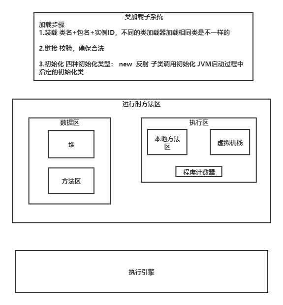
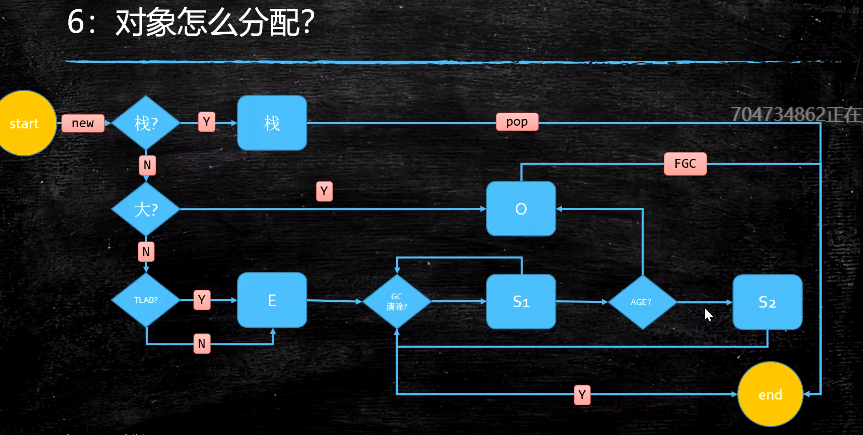
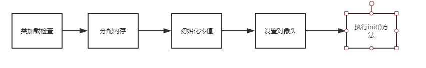

# JVM
编译型语言：
源码-> 编译-> 目标代码-> 执行  
解释型语言 （可以跨平台，匹配到相对的解释器）：
源码-> 解释器-> 执行  

java(解释型语言):
源码-> 编译-> 字节码文件 -（加载到JVM）->解释-> 执行  

## JVM的内存模型

### 类加载子系统：  
加载步骤   
1.装载 类名+包名+实例ID，不同的类加载器加载相同类是不一样的  
 2.链接 校验，确保合法  
 3.初始化 四种初始化类型： new  反射 子类调用初始化 JVM启动过程中指定的初始化类  
### 执行引擎：（待完善）

### 运行时数据区

#### 堆
分为年轻代和年老代 

对象首次创建放在年轻代的Eden区，当对象达到一定年龄（经过N次GC）将对象放到年老代。

### 对象在内存中的存储布局
普通对象  T t = new T();  
1.markword   
2.类型指针   class pointer：指向对象的类   
3.实例数据 instance data   
4.对齐 padding

### 对象头包括什么 markword包括什么
三方面信息：  可以通过jol Java object layout查看
1.锁信息  
2.hashCode()  
3.GC信息 分代  

### 对象怎么分配

 1. 首先在可以往栈上分配先往栈上分配 ：对象小且简单 对标C的struct
 2. 如果对象体量较大，分配到堆上的老年代l
 3. 否则通过TLAB （threa local alocation buffer）分配到年轻代的Eden区
 
#### Object o = new Object()在内存中 占多少字节 16
 
### HotSpot虚拟机
#### 对象创建过程

1. 类加载检查：jvm在遇到new指令时，先检查指令参数能否在常量池中定位到这个类的符号引用，并检查这个给符号引用代表的类是否已被加载、
解析和初始化过。如果没有必须先执行相应的[类加载过程](https://blog.csdn.net/zhangliangzi/article/details/51319033)。
2. 分配内存：在类加载检查完成后，为新生对象分配内存，对象所需的内存大小在类加载完成之后便可以确定，为对象分配空间的任务等于把一块
确定大小的内存从堆空间划分出来。