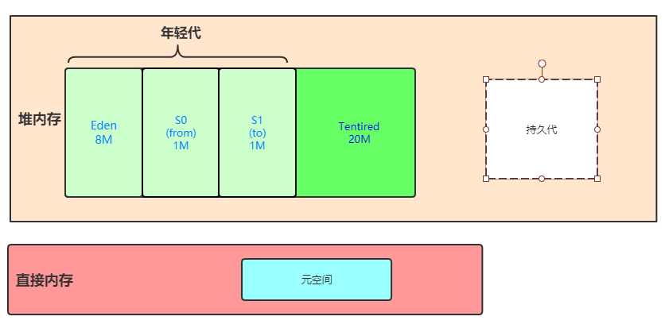

## GarbageCollection

CMS->G1->ZGC

## 概述 
java的自动内存管理主要是针对```对象```内存的回收及分配,而在jvm的内存模型中，对象主要存储在堆栈上，故GC也主要发生在堆栈上。
从垃圾回收的角度上，现在的回收器主要采用分代模型以便能更快的进行内存的回收与分配。堆空间的基本结果如下：  
  
一般来说，新生对象会在Eden区被分配，当经过一次新生代垃圾回收(Minor GC)之后，没有被回收的对象会进入S1(to survivor)区，Eden区的对象进入S1区之后，年龄会被初始化为1。
随后每经过一次Minor GC,没有被回收的对象的年龄就+1。当对象的年龄到达15以后进入老年区(CM对象年龄在6以后就进入老年区)。  
-  新生代GC(Minor GC):发生在新生代的垃圾回收行为比较频繁，且垃圾回收速度也比较快。
-  老年代GC(Major GC/Full GC):Major GC会伴随着至少一次Minor GC(不绝对)，Major GC的回收速度比Minor GC慢10倍以上。

## 判断对象已死亡
可以通过以下几种方法来判断对象是否需要回收：  
1. 引用计数：对象每被引用一次，引用计数就+1，当引用计数为0时，此时说明此对象处于不被引用状态，则可以进行回收。但是现在主流的Garbage Collector都不使用该策略，
原因是引用计数无法解决循环引用的问题。如果A,B对象互相引用，则两者引用计数均为1，但实际上A,B两个对象都是没意义的对象，但使用计数引用的GC不会回收。
2. 可达性分析：基本思想是通过一系列被称为*GC Roots*的对象作为根节点，从这些根引用时就会向下延伸出别的节点，形成一个树状结构，每一个可达的节点（从根节点到该节点有路径）都是被引用的，不可达的节点是无其他对象引用或者是只有循环引用的。


### CMS垃圾回收器模型：
缺点：漏标（有用的被标记清楚），浮动垃圾
初试标记->并发标记->重新标记->清楚

漏标：A->B->D 第一次标记时，B->D引用消失，第二次标记增加A->D引用。D漏标

三色标记算法：黑 （自己已标记，fields已标记），灰（自己标记，fields未标记），白（未标记）


Remember Set

解决漏标方法；
CMS Increamention Update 依然可能产生漏标
G1: SATB Snapshot At the Begining  
ZGC: the zero Garbage Collector

CMS:回收6次之后进入老年代
其他：回收15次进入老年代

