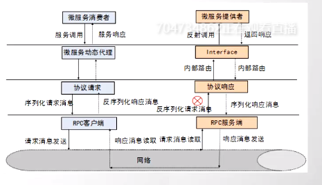

# RPC框架
1. 建立远程通信（Socket） BIO/NIO(Netty)
2. 数据采集
3. 序列化/反序列化 {xml/json/Protobuf/avro/kyro/hessian}



1.动态代理
    javassist cglib asm
客户端
1. 组装参数(类，方法，参数，参数类型)
2. 序列化
3. 网络传输
服务端(BIO-阻塞IO)
1. 发布服务(服务对象，端口)

```java
public class RpcProxyServer{
    //不断监听客户端链接-没有客户端链接时，阻塞accept()
    public void main(){
        try{
            Socket socket = serverSocket.accept();
            //上述过程为建立通信
            while(true){
                //下面基于这个通信进行数据传输
                //IO阻塞时，此时如果客户端没有数据传输过来
                //阻塞会导致只能处理一个IO请求，所以建立线程池来缓存多余线程。
                //将
                socket.getInputStream();
                socket.getOutputStream();}
        }catch(IOException e){
        }
    }
}

```
3. 