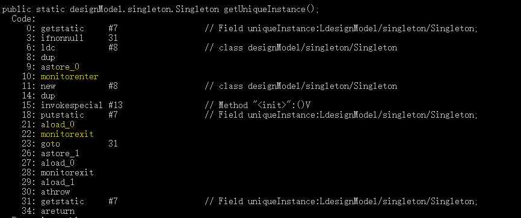
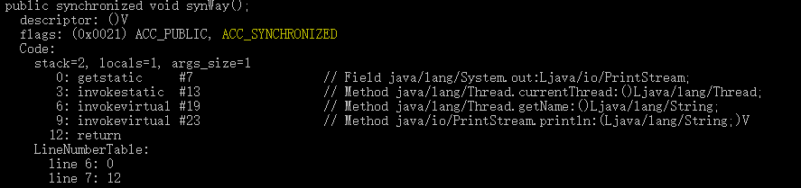

# java零散知识点总结
#### 1.String  
String使用final来修饰字符数组来保存字符串，所以String对象不可变
```java
class String{
    @Stable
     private final byte[] value;
    public static void main(String args[]){
        String str1 = "hello";
        String str2 = ",";
        Stirng str3 = "world";
        String str = "hello,world";
        System.out.println(str == "hello"+","+"world");
        System.out.println(str == str1+str2+str3);
    }
}
```
输出结果：  
    true  
    false  
```String str ="hello"+"world" ;``` 该赋值语句一共产生了1个对象。
虽然java中将字符串常量赋值给字符串对象，常量会存在字符串缓冲池中，而对象保留的是指向该缓冲池的引用。
但是，编译器会在编译阶段完成字符串的拼接，即将```"hello"+"world"```在编译阶段拼接成一个字符串```helloworld```，
然后将该字符串存入字符串缓冲池中。但是如果字符串拼接对象是引用类型，在字符串的拼接是在运行时进行。  

总结来说就是：字面量"+"拼接是在编译期间进行的，拼接后的字符串存放在字符串池中；而字符串引用的"+"拼接运算实在运行时进行的，新创建的字符串存放在堆中。


> StringBuffer与StringBuilder类，两者都继承了AbstractStringBuilder类，区别是StringBuffer实现父类方法是加了synchronized关键字，对方法使用了同步锁，是线程安全的。

对于三者使用的总结：

 1.操作少量的数据: 适用String  
 2.单线程操作字符串缓冲区下操作大量数据: 适用StringBuilder  
 3.程操作字符串缓冲区下操作大量数据: 适用StringBuffer

```java
abstract class AbstractStringBuilder implements Appendable, CharSequence {
    byte[] value;
    //编码方式分为UTF16和LATIN1
    byte coder;
    int count;
    AbstractStringBuilder() {
    }
    AbstractStringBuilder(int capacity) {
        value = new char[capacity];
    }
    //以String为参数列表的构造方法
    AbstractStringBuilder(String str) {
        int length = str.length();
        int capacity = (length < Integer.MAX_VALUE - 16)
                ? length + 16 : Integer.MAX_VALUE;
        final byte initCoder = str.coder();
        coder = initCoder;
        value = (initCoder == LATIN1)
                ? new byte[capacity] : StringUTF16.newBytesFor(capacity);
        append(str);
    }
}
```   
#### 2.泛型
泛型的三种使用方法：泛型类、泛型接口、泛型方法。泛型的类型参数只能是类类型（包括自定义类），不能是简单类型。  
- 泛型标识Type可以写任意合法的标识号，用来代指指定的泛型类型，但是在泛型类实例化是必须指定泛型的类型。  
  泛型类的声明如下：
```java
public class Generic<Type> {
    private Type value;
    public Generic() {
    }
    public Generic(Type value) {
        this.value = value;
    }
}
```
- 泛型接口与泛型类类似，泛型接口声明如下
```java
public interface General<T> {
    public T getValue();
}
```
-泛型方法比较复杂。（此处借鉴其他人博客上的说明）
1. public 与 返回值中间<T>非常重要，可以理解为声明此方法为泛型方法，只有声明了<T>的方法才是泛型方法，泛型类中的使用了泛型的成员方法并不是泛型方法。  
2. <T>表明该方法将使用泛型类型T，此时才可以在方法中使用泛型类型T。
```java
public class Test<Type>{
    public <T> T genericMethod(Class<T> tClass) throws InstantiationError,
    llegalAccessException{
        T instance = tClass.cast(tClass);
        return instance;
    }
}
``` 
#### ==和equals()
==是判断两个对象的地址是否相同，而equals是判断两个对象的内容是否相同。以String对象为例  
```java
public class test{ 
    String str1 = "a";
    String str2 = new String(a);
}
```
对于String而言，对象str1是一个常量，其值a的地址存储在常量池中，而str2存储在系统分配的堆中。
另外对于java来说我们不能得到对象的实际内存地址，因为java中的堆是由JVM管理的，但是我们可以通过hashcode()这个方法来查看两者的地址关系，JVM回通过哈希码在真正的内存堆中给对象分配地址。但是不意味着哈希码相同，对象的地址就相同了。
我们可以看一下string.hashcode()和String.equals()的源码。  
```java
public final class String{
    public int hashCode() {
        int h = hash;
        if (h == 0 && !hashIsZero) {
            h = isLatin1() ? StringLatin1.hashCode(value)
                           : StringUTF16.hashCode(value);
            if (h == 0) {
                hashIsZero = true;
            } else {
                hash = h;
            }
        }
        return h;
    }

    public boolean equals(Object anObject) {
        if (this == anObject) {
            return true;
        }
        if (anObject instanceof String) {
            String aString = (String)anObject;
            if (!COMPACT_STRINGS || this.coder == aString.coder) {
                return StringLatin1.equals(value, aString.value);
            }
        }
        return false;
    }

}
```
hashCode() 的作用是获取哈希码，也称为散列码；它实际上是返回一个int整数。这个哈希码的作用是确定该对象在哈希表中的索引位置。hashCode() 定义在JDK的Object.java中，这就意味着Java中的任何类都包含有hashCode() 函数。
在string的hashcode()中，判断编码方式是Latin还是UTF16然后交给对应的类去编码。而在equals中，先判断两者地址是否相同，如果相同那么两者必然相同。若是不相同，继续判断内容是否相同

关于hashcode()的作用：hashset检查插入元素是否重复时首先得到插入对象的。每个Java类都包含hashCode() 函数。但是，仅仅当创建并某个“类的散列表”(关于“散列表”见下面说明)时，该类的hashCode() 才有用


## Java的I/O流
 - 按流向划分分为：输入流和输出流
 - 按操作单元划分：字节流和字符流
 - 按流的角色划分：节点流和处理流
输入流有两种：InputStream(字节流)和Reader(字符流)  
[Input的类](https://github.com/chenzifeng1/JavaLearning/blob/master/src/knowledge/MyInput.java)
```java
public class input{
    public String inputFirstWay(){
        Scanner input = new Scanner(System.in);
        return input.nextLine();
    }
    
    public String inputSecondWay(){
        BufferedReader input = new BufferedReader(new InputStreamReader(System.in)); 
        String s = input.readLine(); 
        reuturn s;
    }   
}
```
输出流有两种：OutputStream(字节流)和Writer(字符流)
```java
public class output{
    
}
```

## 浅拷贝和深拷贝
    浅拷贝：对基本数据类型进行值传递，对引用数据类型进行引用传递般的拷贝，此为浅拷贝。
    深拷贝：对基本数据类型进行值传递，对引用数据类型，创建一个新的对象，并复制其内容，此为深拷贝。
    
## 数组拷贝函数
 在Arrays类有关拷贝的函数  
 返回类型：返回一个泛型数组
 参数：
 1. U[] original ：泛型数组，需要拷贝的目的数组
 2. int newLength：拷贝的长度
 3. Class<? extends T[]> newType ：返回的数组类型
  
 ```java
public class Arrays{

   public static <T,U> T[] copyOf(U[] original, int newLength, Class<? extends T[]> newType) {
        @SuppressWarnings("unchecked")
        T[] copy = ((Object)newType == (Object)Object[].class)
            ? (T[]) new Object[newLength]
            : (T[]) Array.newInstance(newType.getComponentType(), newLength);
        System.arraycopy(original, 0, copy, 0,
                         Math.min(original.length, newLength));
        return copy;
    }  
  
}
```
 
## Arrays.asList()
Arrays.asList()是泛型方法，传入的对象必须是对象数组。
当传入一个基本数据类型数组时，Arrays.asList() 的真正得到的参数就不是数组中的元素，而是数组对象本身。
Arrays.asList() 方法返回的并不是 java.util.ArrayList ，而是 java.util.Arrays 的一个内部类,这个内部类并没有实现集合的修改方法或者说并没有重写这些方法。  
将Array转为真正的ArrayList有一下几种方法
```java 
public class ArrayToList{
    public static void main(String args[]){
    Array array = new Array({1,2,3});
    ArrayList arys = new ArrayList<>(array.asList());   //利用ArrayList的构造方法来实现
    }
}
```

## fail-fast与fail-safe机制
两者都是为了应对列表并发修改出错引入的模式。fail-fast在多线程修改列表结构时会抛出ConcurrentModificationException(并发修改异常).来阻止多线程对列表的不正确修改。
而fail-safe则是在多线程环境下修改列表结构时创建一个临时对象，在临时对象内修改。这样可以保证多线程下的安全，但是问题是会带来大量的临时列表元素的拷贝，带来额外开销。


## synchronized与volatile
两者都是用来保证线程安全的。两者的区别如下：
1. 锁的量级：volatile是轻量级锁，而synchronized属于重量级锁。这个导致了使用两者会带来不同的性能。
2. 作用领域：volatile只可以作用于变量字段，而synchronized不仅可以作用于变量字段，还可以作用于方法或代码段。
3. 作用：volatile有两个作用，一个是线程间可见，另一个是防止指令重排序。而synchronized的作用是限定代码模块同步，即给对应的指令加锁，使一次只能有一个线程访问。  
通常使用synchronized更加频繁，两者都使用的情况可以见DCL(double check lock，双重校验锁)，我们用双重校验锁来实现一个单例模式。具体代码见[双重校验锁实现单例](https://github.com/chenzifeng1/JavaLearning/blob/master/src/designModel/singleton/Singleton.java)  

### 深度解析synchronized
我们以单例模式为例，在对应的.java文件目录下，使用命令```javac Singleton.java```对Singleton该类进行编译，得到Singleton.class的java字节码文件。
然后使用命令```javap -c Singleton```对该字节码文件进行反汇编。得到该类的汇编代码。  
  
可以看到被monitorenter与monitorexit包裹的部分就是synchronized锁住的同步代码段。如果使用synchronized来修饰方法，汇编代码效果如下：  
我们对一个synchronized方法进行编译，和反汇编。注意反汇编使用命令```javap -c -s -v -l Singleton```得到
```java
public class SynchronizedTest {

    public synchronized void synWay(){
        System.out.println(Thread.currentThread().getName());
    }

}
```

可以看到该方法通过ACC_SYNCHRONIZED来标识该方法为一个同步方法。

### String
