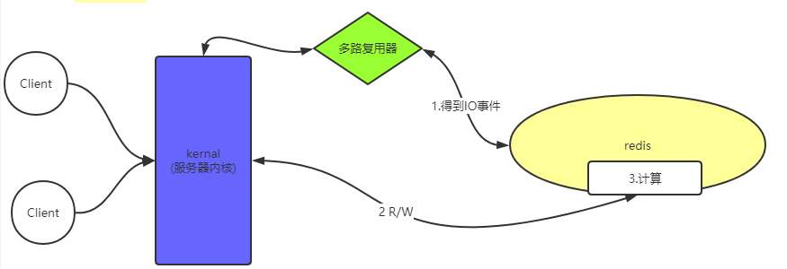
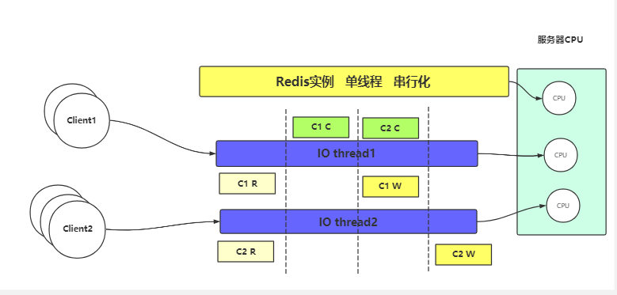
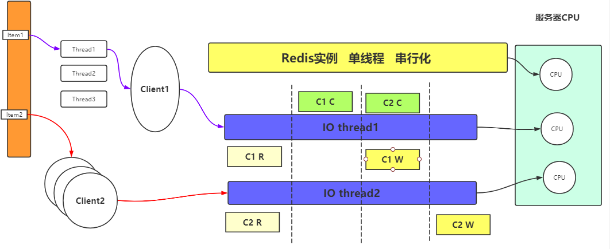

# redis
特质：内存，K-V，单线程（工作线程），IO模型（epoll），value是由类型的——五种类型+每个类型具有本地方法—>触发计算向数据移动  

由于redis工作线程(worker)是单线程的，所以在第二步R/W时，是遍历I/O事件，将其放到队列中，可以说R/W是串行进行的。也因为R/W是串行的，
所以计算也是串行的。

应用场景：

本地缓存：以jvm自带的map和guava为例，特点是轻量快速。生命周期随着jvm的销毁而消除，并且在多实例的情况下，多个实例有各自的缓存，无法保证数据的一致性问题。
分布式缓存： redis或者memcached都是分布式缓存，即多个实例共享一个缓存，可以保证缓存数据的一致性。
 
### redis线程模型
redis与memchached的区别，为何redis是单线程模型却能支持高并发。  
fork模式：使用最基本的进程运行方式，单实例运行服务器。  
cluster模式：集群模式，多个同时运行的服务器实例。  
redis使用文件事件处理器**file event handler**,这个文件事件处理器是单线程的，所以redis才称作单线程模型。  
redis使用IO多路复用机制来监听多个socket，根据socket上的事件来选择对应的事件处理器。  
redis的文件事件处理器包括四个部分:   
1. 多个socket
2. IO多路复用程序 监听socket： 多路复用器可以告诉redis读取哪个io事件，首选epoll，如果没有的话会降级处理，比如降级成poll。
3. 文件事件分派器 
4. 事件处理器（连接应答处理器、命令请求处理器、命令回复处理器）

每个socket可能并发产生不同的操作，每个操作对应不同的文件事件，但是IO多路复用机制会将socket发生的操作放在队列中排队，文件事件分派器会从队列中取出事件，交给对应的事件处理器来处理。  

### 缓存雪崩和缓存穿透
缓存雪崩：缓存在同一时间大面积瘫痪，大量请求访问数据库而导致数据库崩溃  
解决方案：  
   事前：保证缓存集群高可用，当一个缓存服务器宕机之后，有备用服务器可以继续使用。  
   事中：使用ehcache + hystrix限流&降级。请求先走本地缓存ehcache，如果本地内存有数据就直接返回，没有再走redis。
         使用限流组件hystrix，假设用户有5k个请求，限流组件通过2K个请求，使这些请求可以访问数据库，其他3k个请求进行降级处理（返回设置好的默认值，或者是*请求重试*）。   
   事后：利用redis持久化机制保持的数据尽快恢复缓存。
   
缓存穿透：缓存的本质是在一个I/O速度较快的存储区预先存储一些可能会使用到的数据，使请求不需要到数据库层面来找数据。
    缓存穿透就是请求出现大量缓存不命中（人为构造大量缓存中不存在的key，比如使用脚本构造一些无效的key，然后进行请求访问，这些无效且不合法的key肯定不在缓存中，于是就要去数据库层查找数据），使得请求直接越过缓存，对数据库进行访问。  
解决方案：最基本的做法就是对请求的参数进行合法性判断,比如说对小于零或者大于最大值的索引抛出IllegalArgumentException或者使对邮箱，电话格式的合法性检查。
但是这些合法性检查只是一个最基本的预防手段。  
    缓存无效key：  
    布隆过滤器：具体是这样做的：把所有可能存在的请求的值都存放在布隆过滤器中，当用户请求过来，我会先判断用户发来的请求的值是否存在于布隆过滤器中。

### IO Threads的使用方式
考虑以下场景：服务器为多核CPU，如4核，我们将一个redis实例部署到一个CPU上，因为redis是单线程的，所以另外3个CPU处于空闲状态。
这时候如果我们部署多个redis实例，这样的话可能会在网卡部分发生不同redis进程之间的资源竞争问题。因为网络带宽是固定的，每个redis进程都会占用带宽。
那么如何来对服务器配置进行优化，这时候可以考虑引入IO Threads.在不同的cpu上绑定IO线程，这样的话IO线程与redis实例就会并发进行服务。
    

如果不事先读取IO中的内容，那么redis无法有选择的获取某个特定IO的内容。因为对redis来说，它的多路IO复用程序只能看到有几个IO,也就是说在IOthread未处理IO之前，
里面的内容对redis来说是不可见的。我们虽然无法选择读IO的顺序，但是一个IO连接内的数据传输顺序是固定的。
但是，如果客户端时多线程的，在某种场景下，客户端有多个线程同时向IO线程传输数据，这时候我们就没办法控制IO连接内的数据传输顺序了。
比如，我们在读取Item(某个共享资源，有多个不同的实例)的时候，多客户端多线程情况。图示如下：  
  
我们可以通过负载均衡将读取不同Item的请求分发到不同的客户端上

### 数据
1. [key-value](#key-value)
2. hash
3. set
4. zset(sort set)
5. list

应用类型：
###key-value
 
  
