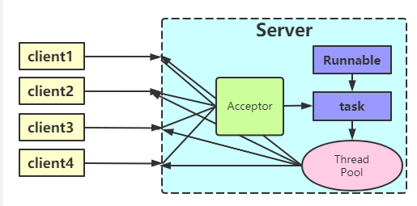

# IO

同步与异步
- 同步：两个同步任务相互依赖，并且一个任务需要依赖另一个任务的某种方式才能执行。比如在A->B模型中，必须等A执行完才能执行B。
即同步调用中，被调用者执行完才会返回，调用者会一直等待被调用者返回结果。
- 异步：两个异步任务完全独立，一方的执行不需要等待另一方的执行。即异步调用中，调用者不需要等待被调用者返回结果，在被调用者
返回结果时，只需要通过回调函数或者是其他方式通知调用者拿结果就行。  

阻塞与非阻塞
- 阻塞：调用者发起请求之后，调用者线程会被挂起，一直等待请求结果的返回。无法从事其他任务，只有等条件就绪时才能继续。
- 非阻塞：调用者发起请求之后，不需要等待请求结果的返回，调用者线程正常运行。

### BIO(blocking IO)
同步阻塞IO模式，数据的读出和写入必须在一个线程内等待其完成。

#### 传统BIO模型
采用BIO的服务端一般会用一个独立的*Acceptor*来监听客户端的连接，具体做法是在 *while(true)* 循环中使用*accep()* 函数来接收客户端的连接，来监听请求。
一旦接收到请求，就会建立通信套接字并进行读写。在连接期间不接受其他客户端的请求，当然我们可以通过多线程来实现多个客户端同时读写。如果要想BIO服务器支持多个客户端，
必须用多线程，原因是*socket.accept(),socket.read(),socket.write()* 这三个主要函数都是同步阻塞的。服务器端每接收到一个客户端连接，都会创建一个线程来进行链路连接，
在线程内执行读写，读写完毕后向客户端返回数据、断开连接、销毁线程。但是在JVM中，线程是宝贵的资源，创建和销毁都要占用大量资源，Linux中线程开销更多。故，如果频繁的进行线程创建和销毁
会导致线程堆栈溢出，以致无法创建新的线程。

#### 伪异步模型
  
采用线程池和任务队列可以实现一种叫做伪异步的 I/O 通信框架，它的模型图如上图所示。当有新的客户端接入时，将客户端的 Socket 封装成一个Task（该任务实现java.lang.Runnable接口）
投递到后端的线程池中进行处理，JDK 的线程池维护一个消息队列和 N 个活跃线程，对消息队列中的任务进行处理。由于线程池可以设置消息队列的大小和最大线程数，因此，它的资源占用是可控的，无论多少个客户端并发访问，都不会导致资源的耗尽和宕机。

