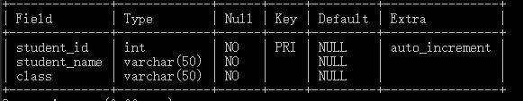
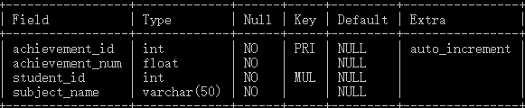
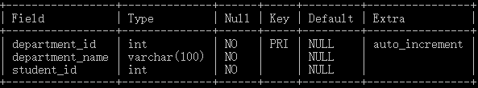

# MySql
1. filesort 并不是说通过磁盘文件进行排序，而只是告诉我们进行了一个排序操作而已

2. 请简要描述MySQL数据库联合索引的命中规则，可举例说明  
    1) MySQL联合索引遵循最左前缀匹配规则，即从联合索引的最左列开始向右匹配，直到遇到匹配终止条件。例如联合索引(col1, col2, col3), where条件为col1=`a` AND col2=`b`可命中该联合索引的(col1,col2)前缀部分, where条件为col2=`b` AND col3=`c`不符合最左前缀匹配，不能命中该联合索引。
    
    2) 匹配终止条件为范围操作符(如>, <, between, like等)或函数等不能应用索引的情况。例如联合索引(col1, col2, col3), where条件为col1=`a` AND col2>1 AND col3=`c`, 在col2列上为范围查询，匹配即终止，只会匹配到col1，不能匹配到(col1, col2, col3).
    
    3) where条件中的顺序不影响索引命中。例如联合索引(col1, col2, col3), where条件为col3=`c` AND col2=b AND col1=`a`, MySQL优化器会自行进行优化，可命中联合索引(col1, col2, col3).  

3. 事务的特性  
   分布式事务本身就是事务，所以也有事务的特性。事务有四个特征ACID：  
   A：原子性（Atomicity）
   事务中的各个操作单元要么全部做，要么就全部不做。不能事务执行后，处于只做一半的状态。  
   C：一致性（Consistency）
   事务执行后，必须由一个一致状态变为另外一个一致状态。  
   I：隔离性（Isolation）
   事务之间不能相互干扰。  
   D：持久性（Durability）
   一旦事务完成，对于数据的变更是永久的。  
   
4. mysql语句  
    设数据库school 存在三个表:student, department,achievement  
     
     
      
     
     
     
   4.1 where  
   4.2 union  
   4.3 添加foreign key (外键)
        比如说，在achievement表中，student_id应该作为外键存在，student_id应该随着对应的
        student表中的student_id的改变而改变  
    ```mysql
        alter table achievement
        add constraint "外键名" foreign key (student_id)
        references student(student_id) on delete cascade on update cascade;
    ```
   4.4 增加字段
   
5. mysql技巧记录  
    5.1 ```CONCAT(str1,str2)``` : 将多个字符拼接，可以在合并字段时使用，比如说两个字段需要在一起展示时，可以将两者拼在一起。
    或者mybatis进行模糊查询时，可以使用```CONCAT('%',#{item},'%')```  
    
    5.2 ```GROUP_CONCAT(DISTINCT(c.id)  SEPARATOR "|")```: GROUP_CONCAT()可以将查询结果进行拼接，并且按分组展示,*DISTINCT*
    是将结果去重，*SEPARATOR* 是拼接结果时使用的分隔符，默认为逗号
    
    5.3 ```(exp1 OR exp2) AND exp3```和 ```exp1 OR exp2 AND exp3```: 前者是查询满足条件1或条件2时，并满足条件3的结果。
    后者是返回满足条件1或者满足条件2和条件3的结果，也就是只要满足条件1就会返回，或者是满足条件2,3返回。
   
    5.4 ``` ON DUPLICATE KEY UPDATE ```:在插入时，如果主键不冲突则插入，如果主键冲突则更新。更新指定字段的sql语句```item = VALUES(item)```跟在后面即可，多个字段之间用逗号隔开。
    