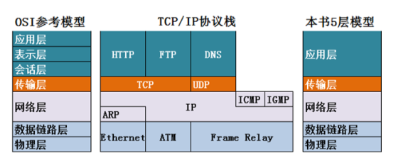
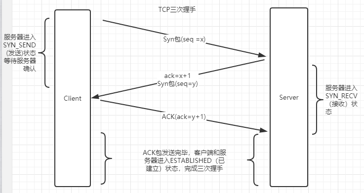
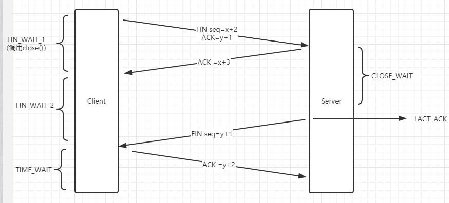

# 计算机网络

## 协议(按7层划分)
- 物理层：RJ45、CLOCK、IEEE802.3    （中继器，集线器，网关*）  
- 数据链路：PPP、FR、HDLC、VLAN、MAC  （网桥，交换机）
- 网络层：IP、ICMP、ARP、RARP、OSPF、IPX、RIP、IGRP、 （路由器）
- 传输层：TCP、UDP、SPX
- 会话层：NFS、SQL、NETBIOS、RPC
- 表示层：JPEG、MPEG、ASII
- 应用层：FTP、DNS、Telnet、SMTP、HTTP、WWW、NFS

#### ARP：地址解析协议(Address Resolution Protocol)
根据IP地址获取物理地址的一个TCP/IP协议  
RARP:反向地址解析协议，根据mac地址获取IP
1：首先，每个主机都会在自己的ARP缓冲区中建立一个ARP列表，以表示IP地址和MAC地址之间的对应关系。

2：当源主机要发送数据时，首先检查ARP列表中是否有对应IP地址的目的主机的MAC地址，如果有，则直接发送数据，如果没有，就向本网段的所有主机发送ARP数据包，该数据包包括的内容有：源主机 IP地址，源主机MAC地址，目的主机的IP 地址

3：当本网络的所有主机收到该ARP数据包时，首先检查数据包中的IP地址是否是自己的IP地址，如果不是，则忽略该数据包，如果是，则首先从数据包中取出源主机的IP和MAC地址写入到ARP列表中，如果已经存在，则覆盖，然后将自己的MAC地址写入ARP响应包中，告诉源主机自己是它想要找的MAC地址。

4：源主机收到ARP响应包后。将目的主机的IP和MAC地址写入ARP列表，并利用此信息发送数据。如果源主机一直没有收到ARP响应数据包，表示ARP查询失败。

注意：广播（255.255.255.255）发送ARP请求，单播发送ARP响应

#### ICMP协议：因特网控制报文协议。
它是TCP/IP协议族的一个子协议，用于在IP主机、路由器之间传递控制消息

#### TFTP协议: 简单文件传输协议
是TCP/IP协议族中的一个用来在客户机与服务器之间进行简单文件传输的协议，提供不复杂、开销不大的文件传输服务。

#### HTTP协议： 超文本传输协议
是一个属于应用层的面向对象的协议，由于其简捷、快速的方式，适用于分布式超媒体信息系统

#### NAT协议：
网络地址转换属接入广域网(WAN)技术，是一种将私有（保留）地址转化为合法IP地址的转换技术

#### DHCP协议：动态主机配置协议
是一种让系统得以连接到网络上，并获取所需要的配置参数手段，使用UDP协议工作。具体用途：给内部网络或网络服务供应商自动分配IP地址，给用户或者内部网络管理员作为对所有计算机作中央管理的手段。

#### TCP三次握手与四次挥手

第一次握手：客户端发送syn包(seq=x)到服务器，并进入SYN_SEND(发送)状态，等待服务器确认；  

第二次握手：服务器收到syn包，必须确认客户的SYN（ack=x+1），同时自己也发送一个SYN包（seq=y），即SYN+ACK包，此时服务器进入SYN_RECV（接收）状态；

第三次握手：客户端收到服务器的SYN＋ACK包，向服务器发送确认包ACK(ack=y+1)，此包发送完毕，客户端和服务器进入ESTABLISHED（已建立）状态，完成三次握手。

注：1）SYN和ACK是标志位（0/1）（ACK=1表明ack有效），seq是序列号，ack是确认号。  
2）给对方的确认方式就是把对方传来的seq+1并赋给ack。  

第一次挥手：主动关闭方发送一个FIN，用来关闭主动方到被动关闭方的数据传送，也就是主动关闭方告诉被动关闭方：我已经不 会再给你发数据了(当然，在fin包之前发送出去的数据，如果没有收到对应的ack确认报文，主动关闭方依然会重发这些数据)，但是，此时主动关闭方还可 以接受数据。

第二次挥手：被动关闭方收到FIN包后，发送一个ACK给对方，确认序号为收到序号+1。

第三次挥手：被动关闭方发送一个FIN，用来关闭被动关闭方到主动关闭方的数据传送，也就是告诉主动关闭方，我的数据也发送完了，不会再给你发数据了。

第四次挥手：主动关闭方收到FIN后，发送一个ACK给被动关闭方，确认序号为收到序号+1，至此，完成四次挥手。